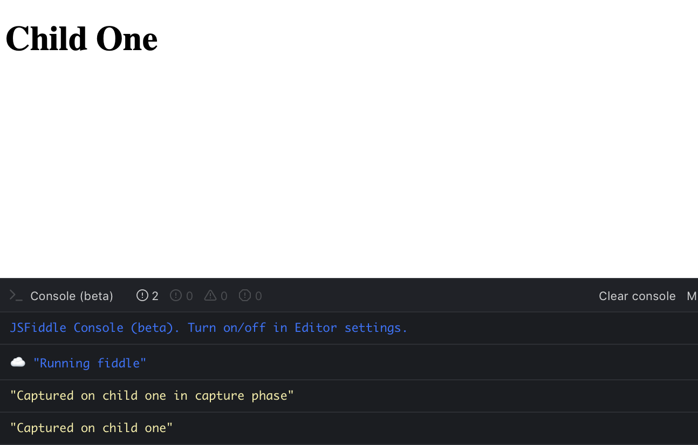

# JavaScript Events Handlers – How to handle events in JavaScript

## What are events? 
Events are actions that happen when a user interacts with the page - for eg, clicking an element, typing in a field, loading a page, etc. The browser notifies the system that something has happened, and it needs to be handled. It gets handled by registering a function, called `event handler`, that listens for a particular type of event. 

## What does it mean to "handle an event"? 
To put it in simple terms, consider this - let's assume you are interested in attending Web Development meetups events in your local community. To do this, you sign-up for a local meetup "Women Who Code" and subscribe to notifications, so that anytime a new meetup is scheduled, you get alerted. That is event handling! The "event" here is a new JS meetup. When a new meetup is posted, the website meetup.com catches this change, thereby "handling" this event. It then notifies you, thereby taking an "action" on the event. 

In a browser, events are handled similarly. The browser detects a change, alerts a function (event handler) that is listening to a particular event. These functions then perform actions as desired. 

An example of `click` event handler - 
 
```
<div class="buttons">
  <button>Press 1</button>
  <button>Press 2</button>
  <button>Press 3</button>`
</div>
const buttonContainer = document.querySelector('.buttons');
console.log('buttonContainer', buttonContainer);

buttonContainer.addEventListener('click', event => {
  console.log(event.target.value)
})

```

## What are the different types of events?
An event can be triggered by any behavior of a user interacting with the page. These events could be a user scrolling the page, clicking an item, loading a page. Here are some common events - `onclick` `dblclick` `mousedown` `mouseup` `mousemove` `keydown` `keyup` `touchmove` `touchstart` `touchend` `onload` `onfocus` `onblur` `onerror ` `onscroll` 

## Different phases of events - capture, target, bubble
When an event moves through the DOM - whether bubbling up or trickling down, it is called event propagation. the event is said to propagate through the DOM tree. Events happen in two phases - the bubbling phase and the capturing phase. 

In capture phase, also called trickling phase, the event "trickles down" to the element that caused the event. It starts from the root level element and handler, and then propagates down to the element. The capture phase is completed when the event reaches the `target`. 

In bubble phase, the event is "bubbled" up to the DOM tree - it is first captured and handled by the innermost handler - the handler that is closest to the element on which the event occurred. It then bubbles up - or propagates up to the higher levels of DOM tree, further up to its parents and then finally to its root. 

A trick to help you remember this - 
```
trickle down, bubble up
```

Here's an infographic from [quirksmode](https://www.quirksmode.org/js/events_order.html) that explains this very well - 
```
               / \
---------------| |-----------------
| element1     | |                |
|   -----------| |-----------     |
|   |element2  | |          |     |
|   -------------------------     |
|        Event BUBBLING           |
-----------------------------------

               | |
---------------| |-----------------
| element1     | |                |
|   -----------| |-----------     |
|   |element2  \ /          |     |
|   -------------------------     |
|        Event CAPTURING          |
-----------------------------------

```

One thing to note is that, whether you register an event handler in either phase, both phases ALWAYS happen. All events bubble by default. You can register event handlers for either phase, bubbling or capturing, by using the function `addEventListener(type, listener, useCapture)`. If `useCapture` is set to `false`, the event handler is in bubbling phase, or else capture phase. The order of the phases of the event depends on the browser.


To check which browser honors capture first, you can try the following code in JSfiddle - 
```html
<div id="child-one">
    <h1>
      Child One
    </h1>
  </div>

```

```javascript
const childOne = document.getElementById("child-one");

const childOneHandler = () => {
console.log('Captured on child one')
}

const childOneHandlerCatch = () => {
console.log('Captured on child one in capture phase')
}

childOne.addEventListener("click", childOneHandler); 
childOne.addEventListener("click", childOneHandlerCatch, true); 
```

In Firefox, Safari, and Chrome, the output is - 
 
 
 
## How to listen to an event?
There are two ways to listen to an event - 
1.  `addEventListener` 
2.  inline events, such as `onclick`

 ```
//addEventListener
document.getElementByTag('a').addEventListener('click', onClickHandler);

//inline using onclick
<a href="#" onclick="onClickHandler">Click me</a>
```

## Which is better - inline event or `addEventListener`?

1. `addEventListener` gives the ability to register unlimited event handlers.
2. `removeEventListener` can also be used to remove event handlers
3. The `useCapture` flag can be used to indicate whether an event needs to be handled in the capture phase or bundled phase.

 
## Code examples and live-action

You can try out these events in JSFiddle to play around with these events. 

```html
<div id="wrapper-div">
  <div id="child-one">
    <h1>
      Child One
    </h1>
  </div>
  <div id="child-two" onclick="childTwoHandler">
    <h1>
      Child Two
    </h1>
  </div>

</div>

```

```javascript
const wrapperDiv = document.getElementById("wrapper-div");
const childOne = document.getElementById("child-one");
const childTwo = document.getElementById("child-two");

const childOneHandler = () => {
console.log('Captured on child one')
}

const childTwoHandler = () => {
console.log('Captured on child two')
}

const wrapperDivHandler = () => {
console.log('Captured on wrapper div')
}

const childOneHandlerCatch = () => {
console.log('Captured on child one in capture phase')
}

const childTwoHandlerCatch = () => {
console.log('Captured on child two in capture phase')
}

const wrapperDivHandlerCatch = () => {
console.log('Captured on wrapper div in capture phase')
}


childOne.addEventListener("click", childOneHandler); 
childTwo.addEventListener("click", childTwoHandler); 
wrapperDiv.addEventListener("click", wrapperDivHandler); 

childOne.addEventListener("click", childOneHandlerCatch, true); 
childTwo.addEventListener("click", childTwoHandlerCatch, true); 
wrapperDiv.addEventListener("click", wrapperDivHandlerCatch, true); 
```


## Futher reading 
https://www.quirksmode.org/js/events_order.html
https://jsfiddle.net/r2bc6axg/
https://stackoverflow.com/questions/6348494/addeventlistener-vs-onclick
https://www.w3.org/wiki/HTML/Attributes/_Global#Event-handler_Attributes

## TL;DR
Event phases are - capture (DOM -> target), bubble (target-> DOM) and target. 
Events can be listened by using `addEventListener` or inline methods such as `onclick`. 

---

To keep up with more tutorials like this, [Sign up for my newsletter.](https://tinyletter.com/shrutikapoor) or [follow me on Twitter](https://twitter.com/shrutikapoor08)